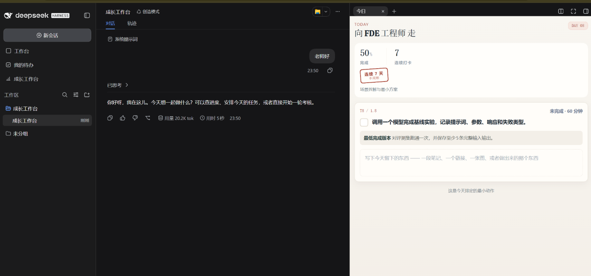
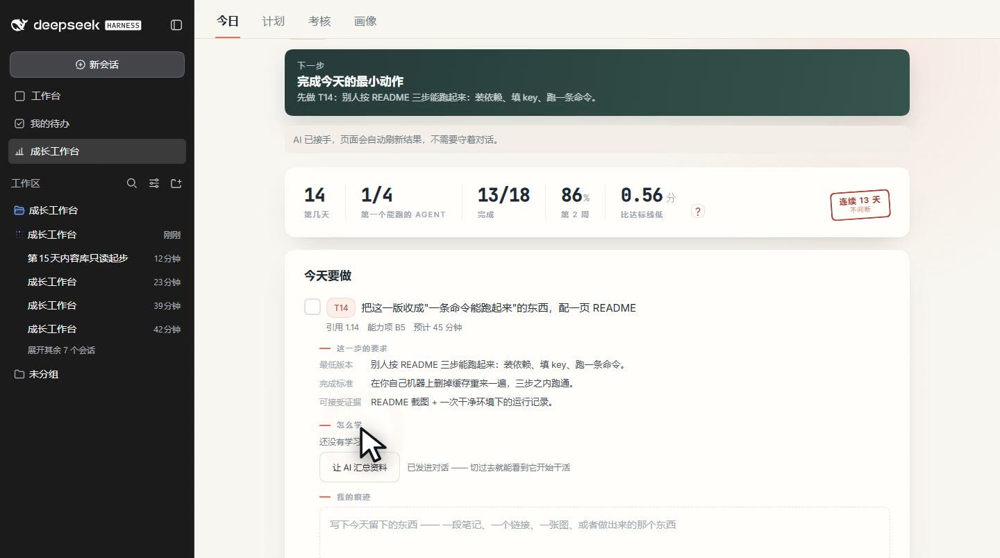

# dsh-growth-workbench

[](LICENSE)
[](https://nodejs.org)
[](https://github.com/deepseek-ai/deepseek-harness)

中文文档 | [English](README.en.md)

**AI 个人成长工作台**（插件名 `dsh-growth-workbench`）—— 给 [DeepSeek Harness](https://github.com/deepseek-ai/deepseek-harness)（CLI 名 `dsh`）用：**把「我要转型」变成今天能做完的一件事。**

装好之后，左侧菜单里多一个「成长工作台」——选一个方向，它把 90 天排成每天一件事；做完留一句证据，到点考一次，按结果调整。

## 它解决什么

想转行、想补一块能力的人，通常卡在三件事上：

- **不知道今天做什么。** 目标太大，落到日历上就是空白。
- **学了很多，拿不出东西。** 说不出自己会什么，也没有能给面试官看的东西。
- **走着走着不知道到哪了。** 没有记录，也没有一次认真的复盘。

这个插件把这三件事接成一条链：**今天做什么 → 留下证据 → 定期考一次 → 按结果调整**。

## 主线

```
目标岗位 → 你的条件 → 当前状态 → 可迁移能力 → 能力模型 → 能力自评
        → 90 天计划 → 今日执行 → 证据 → 考核复盘 → 回到「90 天计划」，按结果调整
```

前面六步在「画像」页签一次做完；计划落到「计划」页签；每天的事在「今日」页签（或右侧的「今日」窄栏）；到点考核在「考核」页签。



*左：DSH 侧栏里它自己的工作区与专属对话　中：**老师**住在这个对话里（所有 AI 运行都发进它）　右：「今日」窄栏 —— 今天只做一件事，做完写一句证据*

▶ **[看 76 秒的完整演示](docs/demo.mp4)**（1440×804）—— 计划 → 今日写证据 → 下一天 → 小考 → 大考 → 老师补资料 → 跟老师说一句。除「老师」那几段是真模型在跑，其余都是页面上**真点出来**的：放大的光标与点击涟漪都不是后期加的，画面全程完整。

[](docs/demo.mp4)

## 安装

需要 Node.js ≥ 22.19、`dsh` CLI 在 `PATH` 上，以及一个支持 bundle 插件的 DSH profile（比如 `web`）。

**从 GitHub 安装（推荐）**

```bash
dsh plugin --profile web add github:mingdui/dsh-growth-workbench
```

**从 npm 安装**

```bash
dsh plugin --profile web add dsh-growth-workbench
```

**从本地目录安装**（改代码时用）

```bash
git clone https://github.com/mingdui/dsh-growth-workbench.git
dsh plugin --profile web add ./dsh-growth-workbench
```

**从 tarball 安装**

```bash
npm pack     # 产出 dsh-growth-workbench-<版本>.tgz
dsh plugin --profile web add ./dsh-growth-workbench-<版本>.tgz
```

**装完都要重启 DSH 进程**（插件清单与包元数据不热更新）。看不到效果先重启。

### 确认装上了

```bash
dsh --profile web --dump-config | grep growth-workbench
# 期望看到：- id: dsh-growth-workbench
```

### 升级

| 安装形态 | 升级命令 |
|---|---|
| git（`github:mingdui/...`） | `dsh plugin --profile web update dsh-growth-workbench` |
| npm | `dsh plugin --profile web update dsh-growth-workbench` |
| 本地目录 | `node scripts/update.mjs` |
| tarball | `dsh plugin --profile web add ./dsh-growth-workbench-<新版本>.tgz` |

git 形态跟的是 `main` 分支，锁文件里 pin 的是提交 SHA —— 你不主动 `update`，插件不会自己变。npm 与 tarball 形态只在版本号变化时才算升级。**升级后同样要重启 DSH，升级不会动你的数据。**

### 卸载

```bash
dsh plugin --profile web remove dsh-growth-workbench
```

只注销插件。`$DSH_HOME/growth-workbench/` 里的数据不会被删 —— 想留底就先把数据导出一份。

## 使用

重启后：左侧菜单 →「成长工作台」→ **画像**。

1. **选方向**。从目录里选一个，或者自己填一个岗位名。
2. **定路线、答四道选择题**。它按你的身份追问几件事（在校问专业年级、在职问岗位行业、自由职业问收入来源和已经在交付的东西）—— 后面的一切都从这几句里推。
3. **确认底子**。点「让 AI 给出底盘候选」，它会把你能迁移的经验列出来；划掉不符合的，勾选确实做过的。
4. **逐项自评**。每项 1/3/5 锚点都在屏幕上，点一下就是一分。这一步之后，你的差距和补强顺序就有了。
5. **生成计划**。点「让 AI 生成计划」，90 天落到「计划」页签。

之后每天只做一件事：打开「今日」，做那道题（卡上写着「怎么上手」「AI 汇总」和几条来源），勾掉，写一句证据 —— 可以配图，也可以加一个文件。

到点会提示考核：**节点小考**每周一次、**阶段大考**每个阶段走完一次。在「考核」页签点「打开考卷」，答完交卷，AI 在你那个专属对话里打分，结果写回页面。

计划不是判决书。计划页与考核页的页脚各有一行 **「和老师聊聊」**：哪一天排得不合适、哪道题你本来就会，直接说，它会改 —— 任务措辞、拆分、预计分钟、某个动作落到哪一天都能商量。**评分标准与铁律不商量**（忙和累不是改分的理由），但下一段的任务难度可以调。它改了什么，在「画像」页页脚的 **「改动记录」** 里一行一条：时间 · 模块 · 一句话。

## 数据放在哪

`$DSH_HOME/growth-workbench/`：`profile.json`（画像）、`plan.json`（计划）、`progress.json`（打卡与证据记录）、`assessments.json`（考核与自评历史）、`evidence/`（证据文件）。页面与 AI 读写的就是这一份，没有第二份。

导出备份：`curl -s localhost:<端口>/gw/api/export > growth-workbench-backup.json`。想换个地方做实验，把 `DSH_HOME` 指过去即可。

## 已知边界

- **能力模型不是严格的行业标准。** 十一个方向的锚点都随版本发布，但只是草稿，页面如实这么标 —— 够用来给自己定位，别拿它当标准。
- **AI 打分没有自动化验收。** 工具本身是拿固定输入验过的；「AI 读完简报能不能打出合理分数」要靠真实对话。
- **没有提醒。** 考核节奏写在计划里，还没有接到定时器。
- **接口没有独立鉴权。** DSH web server 默认只绑 `127.0.0.1`；一旦绑到 `0.0.0.0`，需要自己加一层校验。

## 文档

- [产品文档](docs/产品文档.md) —— 给谁做的、怎么用、有哪些规则
- [架构文档](docs/架构文档.md) —— 怎么实现、数据长什么样、怎么验证
- [产品蓝图](docs/产品蓝图.md) —— 接下来做什么
- [二次开发](docs/二次开发.md) —— 想基于它做自己的版本，从这里开始
- [文档索引](docs/README.md) · [贡献指南](CONTRIBUTING.md) · [变更日志](CHANGELOG.md)

## 许可证

MIT，见 [LICENSE](LICENSE)。
